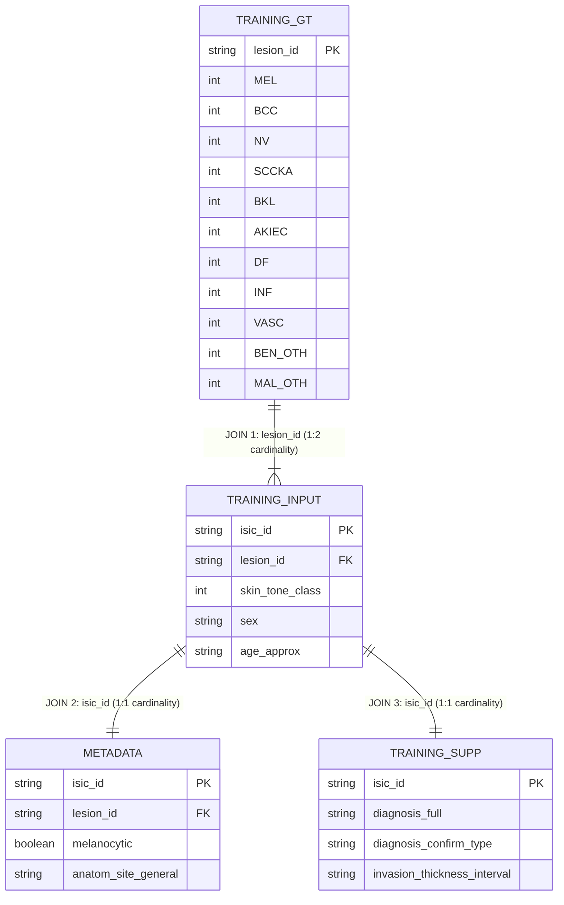

# Phase 1: Data Ingestion, Schema Validation, EDA & Lesion-Level Data Splitting

**SkinCancerTracker Research Engineering Documentation**  
**Specification Reference**: Section §3, Section §4, Section §5, Section §6, Section §7  

---

## 1. Dataset Location and Expected Structure

The primary dermatology dataset is housed locally and mirrored in `data/`:
* **Source Path**: `C:\Users\prtv1\OneDrive\Attachments\Desktop\Dermatology\milk10k`
* **Project Directory**: `data/`
* **Physical Images**: `data/images/` (10,480 `.jpg` files)
* **Metadata & Supplements**: `data/metadata.csv`, `data/training_gt.csv`, `data/training_input.csv`, `data/training_supp.csv`

---

## 2. Actual Verified CSV Filenames

1. `metadata.csv` (2,129,778 bytes)
2. `training_gt.csv` (188,730 bytes)
3. `training_input.csv` (2,587,003 bytes)
4. `training_supp.csv` (641,153 bytes)

---

## 3. Actual Verified Row Counts

* **`metadata.csv`**: **10,480** rows (image-level)
* **`training_gt.csv`**: **5,240** rows (lesion-level)
* **`training_input.csv`**: **10,480** rows (image-level)
* **`training_supp.csv`**: **10,480** rows (image-level)
* **Total Image Records**: **10,480**
* **Total Unique Lesions**: **5,240**
* **Images per Lesion Ratio**: Exactly **2.0 images per lesion** across the entire dataset.

---

## 4. Actual Verified Schemas

### `training_input.csv` (17 columns)
- **Identifiers**: `isic_id` (Primary Key, unique), `lesion_id` (Group Key)
- **Metadata**: `image_type`, `image_manipulation`, `age_approx`, `sex`, `site`, `attribution`, `copyright_license`
- **Fairness Subgroup**: `skin_tone_class` (Integer categories 0 through 5)
- **Clinical Biomarkers**: `MONET_ulceration_crust`, `MONET_hair`, `MONET_vasculature_vessels`, `MONET_erythema`, `MONET_pigmented`, `MONET_gel_water_drop_fluid_dermoscopy_liquid`, `MONET_skin_markings_pen_ink_purple_pen`

### `training_gt.csv` (12 columns)
- **Identifier**: `lesion_id` (Primary Key for lesion ground truth)
- **11 One-Hot Diagnostic Classes**:
  1. `AKIEC` (Actinic keratosis / intraepithelial carcinoma)
  2. `BCC` (Basal cell carcinoma)
  3. `BEN_OTH` (Benign other)
  4. `BKL` (Benign keratosis / seborrheic keratosis)
  5. `DF` (Dermatofibroma)
  6. `INF` (Inflammatory)
  7. `MAL_OTH` (Malignant other)
  8. `MEL` (Melanoma)
  9. `NV` (Melanocytic nevus)
  10. `SCCKA` (Squamous cell carcinoma / keratoacanthoma)
  11. `VASC` (Vascular lesion)

### `metadata.csv` (17 columns)
- `isic_id`, `lesion_id`, `image_type`, `image_manipulation`, `melanocytic`, `sex`, `age_approx`, `anatom_site_general`, `anatom_site_special`, `concomitant_biopsy`, `diagnosis_1`, `diagnosis_2`, `diagnosis_3`, `diagnosis_4`, `diagnosis_confirm_type`, `attribution`, `copyright_license`

### `training_supp.csv` (4 columns)
- `isic_id`, `diagnosis_full`, `diagnosis_confirm_type`, `invasion_thickness_interval`

---

## 5. Relational Join Relationships



* **JOIN 1 (`training_gt.lesion_id` $\leftrightarrow$ `training_input.lesion_id`)**:
  - Unique Lesions: 5,240 on both sides.
  - Coverage: **100.0%**. Unmatched: **0**.
* **JOIN 2 (`training_input.isic_id` $\leftrightarrow$ `metadata.isic_id`)**:
  - Unique Images: 10,480 on both sides.
  - Coverage: **100.0%**. Unmatched: **0**.
* **JOIN 3 (`training_input.isic_id` $\leftrightarrow$ `training_supp.isic_id`)**:
  - Unique Images: 10,480 on both sides.
  - Coverage: **100.0%**. Unmatched: **0**.

---

## 6. Validation Rules (10-Point Schema Engine)

The dataset validator in [`src/data/validator.py`](file:///C:/Users/prtv1/OneDrive/Attachments/Desktop/SkinCancerTracker/src/data/validator.py) executes:
1. **Required Columns**: Enforces exact column presence per configuration.
2. **Unexpected Columns**: Warns on unmapped columns without silently altering schemas.
3. **Column Spelling**: Detects spelling near-misses using string distance. **Never automatically renames columns**.
4. **Identifier Non-Nullness**: Verifies `isic_id` and `lesion_id` contain 0 null values.
5. **Identifier Uniqueness**: Asserts `isic_id` uniqueness as primary key.
6. **Reasonable Data Types**: Rejects floating-point identifiers and non-numeric labels.
7. **Duplicate Rows**: Scans and reports exact record duplications.
8. **Missing Values**: Per-column null counts and percentage summaries.
9. **One-Hot Validity**: Enforces strict `{0, 1}` binary integrity on all 11 diagnostic columns.
10. **File Existence**: Verifies all required tables are present before execution.

---

## 7. EDA Methodology

All statistics and visualizations are computed directly from the CSV tables via [`src/data/eda.py`](file:///C:/Users/prtv1/OneDrive/Attachments/Desktop/SkinCancerTracker/src/data/eda.py) without hardcoding:
- **Lesion Clustering**: Computes image-per-lesion frequency distributions.
- **Diagnostic Distribution**: Evaluates image counts, percentages, and lesion counts for all 11 classes.
- **Skin-Tone Auditing**: Analyzes `skin_tone_class` without fabrication.
- **Cross-Tabulations**: Evaluates intersections between diagnosis, skin-tone, sex, and anatomical sites.

---

## 8. Actual Class Distribution Results

From `training_gt.csv` (Total Lesions: 5,240):

| Class | Name | Image Count | Percentage | Unique Lesions |
| :--- | :--- | :--- | :--- | :--- |
| **BCC** | Basal cell carcinoma | 2,522 | 48.13% | 2,522 |
| **NV** | Melanocytic nevus | 746 | 14.24% | 746 |
| **BKL** | Benign keratosis | 544 | 10.38% | 544 |
| **SCCKA** | Squamous cell carcinoma | 473 | 9.03% | 473 |
| **MEL** | Melanoma | 450 | 8.59% | 450 |
| **AKIEC** | Actinic keratosis | 303 | 5.78% | 303 |
| **DF** | Dermatofibroma | 52 | 0.99% | 52 |
| **INF** | Inflammatory lesion | 50 | 0.95% | 50 |
| **VASC** | Vascular lesion | 47 | 0.90% | 47 |
| **BEN_OTH** | Benign other | 44 | 0.84% | 44 |
| **MAL_OTH** | Malignant other | 9 | 0.17% | 9 |

* **Class Imbalance Ratio**: **280.2x** (`BCC` 2,522 vs `MAL_OTH` 9).
* **Multi-Label Check**: Strictly mutually exclusive (every lesion has exactly one active diagnosis among the 11 classes).

---

## 9. Actual Skin-Tone Distribution Results

From `training_input.csv` (Total Images: 10,480, Total Lesions: 5,240):

| Skin Tone Class | Image Count | Percentage | Unique Lesions |
| :--- | :--- | :--- | :--- |
| **Class 3** | 6,348 | 60.57% | 3,174 |
| **Class 4** | 2,132 | 20.34% | 1,066 |
| **Class 2** | 1,012 | 9.66% | 506 |
| **Class 5** | 766 | 7.31% | 383 |
| **Class 1** | 210 | 2.00% | 105 |
| **Class 0** | 12 | 0.11% | 6 |

* **Missing / Unannotated Skin Tones**: **0** (100% annotated in source `training_input.csv`).
* **Ethical Rule**: No skin-tone labels were inferred or fabricated.

---

## 10. Split Ratios & Configuration

* **Method**: Two-stage `sklearn.model_selection.GroupShuffleSplit`
* **Grouping Variable**: `lesion_id`
* **Target Ratios**:
  - Train: **70.0%**
  - Validation: **15.0%**
  - Test: **15.0%**

---

## 11. Random Seed

* **Configured Seed**: `42`
* Guarantees deterministic, reproducible split assignments across runs.

---

## 12. Why Lesion-Level Splitting Is Necessary

In dermatology imaging, a single lesion is often captured multiple times (e.g. dermoscopic close-up, polarized light, cross-polarized light, clinical overview, or longitudinal monitoring across visits).

**If splitting is performed randomly by `isic_id`**:
Images of the same lesion would appear simultaneously in both `train` and `test` splits. A neural network could trivially memorize patient-specific artifacts (hair, ruler markings, skin pigmentation pattern, lighting) rather than learning generalized lesion pathology. This constitutes severe **data leakage**, resulting in falsely inflated benchmark performance and catastrophic clinical failure.

---

## 13. Leakage Prevention Strategy

* The splitting pipeline in [`src/data/splitting.py`](file:///C:/Users/prtv1/OneDrive/Attachments/Desktop/SkinCancerTracker/src/data/splitting.py) groups records strictly by `lesion_id`.
* The test suite in [`tests/test_splitting.py`](file:///C:/Users/prtv1/OneDrive/Attachments/Desktop/SkinCancerTracker/tests/test_splitting.py) enforces:
  ```python
  assert train_lesions.isdisjoint(validation_lesions)
  assert train_lesions.isdisjoint(test_lesions)
  assert validation_lesions.isdisjoint(test_lesions)
  ```
* Leakage verification is executed automatically whenever splits are generated.

### Actual Generated Split Cardinality
* **Train**: 3,668 lesions (70.00%) | 7,336 images (70.00%)
* **Validation**: 786 lesions (15.00%) | 1,572 images (15.00%)
* **Test**: 786 lesions (15.00%) | 1,572 images (15.00%)
* **Total**: 5,240 lesions | 10,480 images
* **Measured Leakage**: **0 shared lesions (100% disjoint)**.

---

## 14. Commands to Reproduce All Outputs

All commands are executable directly from the repository root:

```bash
# 1. Run Schema and Relational Join Validation (Strict Mode)
python -m src.data.validator --data-root data --config configs/data.yaml --strict

# 2. Run Reproducible Exploratory Data Analysis (EDA) Pipeline
python -m src.data.eda --data-root data --config configs/data.yaml --output-dir data/processed/eda

# 3. Generate Lesion-Level Splits (GroupShuffleSplit by lesion_id)
python -m src.data.splitting --data-root data --config configs/data.yaml --output-dir data/splits

# 4. Run Complete Automated Test Suite
pytest -v
```

---

## 15. Known Limitations

1. **Class Skew**: `MAL_OTH` has only 9 lesions and `BEN_OTH` has 44, while `BCC` has 2,522. When splitting grouped data into small validation/test sets, stratified class-weighted sampling or class-weighted loss functions (Phase 2) will be required to handle rare diagnoses.
2. **Skin-Tone Distribution Disparity**: Skin tones 3 and 4 represent 80.9% of the dataset, while skin tone 0 represents 0.11% (6 lesions) and skin tone 1 represents 2.0% (105 lesions). Subgroup metrics must be evaluated with denominator-safe statistics.

---

## 16. Missing or Unresolved Data Issues

* No corrupted or unreadable images were detected among the 10,480 samples.
* In `training_supp.csv`, `invasion_thickness_interval` is missing in 95.31% of records (expected for non-invasive or non-melanoma lesions).
* In `metadata.csv`, `anatom_site_special` is missing in 98.03% of records.
* All required identifiers (`isic_id`, `lesion_id`) and diagnostic labels are 100% complete with 0 missing values.
